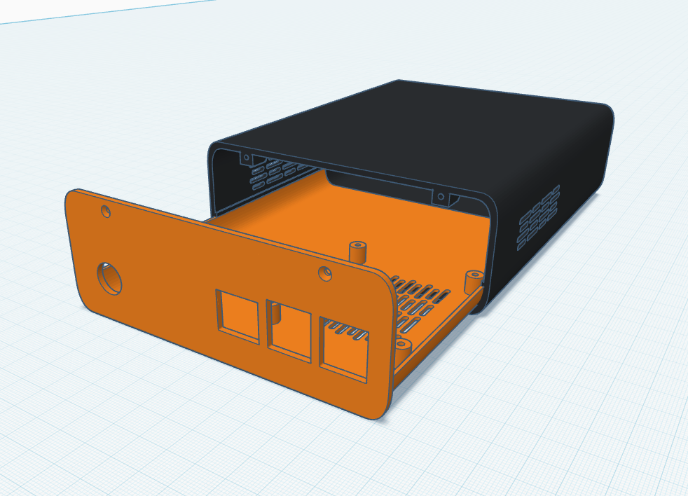

<p align="center">
  <picture>
    <source media="(prefers-color-scheme: dark)" srcset="https://raw.githubusercontent.com/Koberum/Sonect/main/packages/frontend/public/sonect-logo-dark.svg">
    <source media="(prefers-color-scheme: light)" srcset="https://raw.githubusercontent.com/Koberum/Sonect/main/packages/frontend/public/sonect-logo-light.svg">
    
  </picture>
</p>

<p align="center">
  <em>Self-hosted music streaming, powered by <a href="https://www.musicpd.org/">Music Player Daemon</a>.</em>
</p>

<p align="center">
  <a href="https://sonect.dev"></a>
  <a href="https://github.com/Koberum/Sonect/actions/workflows/ci.yml"></a>
  <a href="https://github.com/Koberum/Sonect/actions/workflows/release.yml"></a>
  <a href="LICENSE"></a>
</p>

---

Sonect wraps MPD in a modern React interface. Browse your library by album,
artist, or genre, control playback in real time, and never depend on a
streaming service again. Everything runs on your own hardware — no telemetry,
no subscriptions, no limits.

---

## Features

- **MPD-powered playback** — Gapless, battle-tested, supports virtually any
  audio format. Repeat, random, consume, and single modes are all first-class.
- **Live WebSocket state** — Playback changes reflect instantly across every
  open tab. MPD idle events are pushed to all connected clients in real time.
- **Smart queue strategy** — Album, artist, then genre fallback fills your
  queue intelligently. No more dead air between tracks.
- **Album art pipeline** — Artwork is extracted from your audio files, resized
  to 500x500 JPEG, served over HTTP, and cached in the browser for 30 days.
- **In-browser MPD config** — Edit audio outputs and MPD settings from the
  Settings page. Save once, MPD restarts automatically — no SSH needed.
- **One-line Raspberry Pi install** — A single `curl | bash` command turns a
  Pi 2B into a dedicated music appliance. See below.

---

## 3D Printed Case

A custom two-part case designed for the **Raspberry Pi 2B**, turning your Pi
into a compact, self-contained Sonect appliance.



| Part     | File                                                                                                         |
| -------- | ------------------------------------------------------------------------------------------------------------ |
| Interior | [`assets/screenshots/stls/sonect_case_interior_v3.stl`](assets/screenshots/stls/sonect_case_interior_v3.stl) |
| Exterior | [`assets/screenshots/stls/sonect_case_exterior_v3.stl`](assets/screenshots/stls/sonect_case_exterior_v3.stl) |

Print in PLA or PETG. No supports required. Assembles with 4x M2.5 screws.

---

## Quick Start

### Development (local machine)

```bash
git clone https://github.com/Koberum/Sonect
cd Sonect
pnpm install

# Configure your music directory
cat > packages/backend/.env << EOF
MPD_HOST=localhost
MPD_PORT=6600
MUSIC_DIR=/home/you/Music
COVERS_DIR=./data/covers
EOF

# Start everything
pnpm dev
```

Open `http://localhost:5173` and trigger a library scan from the Settings page.

### Raspberry Pi (production)

```bash
curl -fsSL https://raw.githubusercontent.com/Koberum/Sonect/main/installer.sh | sudo bash
```

This installs Node.js, MPD, and all dependencies, downloads the latest
prebuilt release, creates a systemd service, and starts Sonect on port 3000.
Your music goes in `/opt/sonect/music/`.

---

## Architecture

```
sonect/
├── packages/
│   ├── backend/       Express 5 API + WebSocket server (port 3000)
│   ├── frontend/      React 19 + Vite SPA (port 5173 in dev)
│   ├── @repo/db/      SQLite schema, migrations, query helpers
│   └── @repo/types/   Shared TypeScript types (no runtime deps)
├── assets/            Screenshots and 3D print files
├── conf/              MPD configuration
├── data/              MPD state, sticker DB, tag cache, playlists
└── music/             Mount point for your music library
```

```
Browser ──HTTP──► Express API ──► MPD (port 6600)
        ──WS───► WebSocket server ──► MPD idle listener
```

The backend maintains two TCP connections to MPD: a command client for
playback control and a polling client for status updates. The in-memory cache
is refreshed every 2 seconds during play (10 s during pause/stop) and
immediately after user-initiated commands.

---

## API Overview

| Method | Path                          | Description              |
| ------ | ----------------------------- | ------------------------ |
| GET    | `/library/albums`             | List all albums          |
| GET    | `/library/albums/:id`         | Get album by ID          |
| GET    | `/library/albums/:id/tracks`  | Tracks for an album      |
| GET    | `/library/artists`            | List all artists         |
| GET    | `/library/artists/:id/albums` | Albums for an artist     |
| POST   | `/library/scan`               | Trigger library re-scan  |
| POST   | `/mpd/play`                   | Play a track or resume   |
| POST   | `/mpd/pause`                  | Toggle pause             |
| POST   | `/mpd/next`                   | Next track               |
| POST   | `/mpd/previous`               | Previous track           |
| PATCH  | `/mpd/volume`                 | Set volume (0–100)       |
| GET    | `ws://host:3000`              | WebSocket playback state |

### Environment variables

Configure via `packages/backend/.env`:

| Variable          | Default                           | Description                    |
| ----------------- | --------------------------------- | ------------------------------ |
| `MPD_HOST`        | `localhost`                       | MPD server hostname or IP      |
| `MPD_PORT`        | `6600`                            | MPD server port                |
| `MUSIC_DIR`       | `/music`                          | Root of your music library     |
| `COVERS_DIR`      | —                                 | Where cover JPEGs are cached   |
| `DB_PATH`         | `./data/music.db`                 | SQLite database path           |
| `MPD_CONFIG_PATH` | `/opt/sonect/data/mpd-audio.conf` | MPD config drop-in             |
| `MPD_LOG_PATH`    | `/var/lib/mpd/mpd.log`            | MPD log file for sync progress |
| `PORT`            | `3000`                            | Backend HTTP port              |
| `FRONTEND_DIST`   | `../frontend/dist`                | Built frontend static files    |

---

## Build & Deploy

```bash
pnpm build          # Compile all packages
pnpm lint           # Lint all packages
pnpm backend:test   # Run backend tests
pnpm backend:bundle # Bundle backend for production
pnpm frontend:build # Build frontend for production
```

### Releases

Versions follow [SemVer](https://semver.org) and are managed by
[release-please](https://github.com/googleapis/release-please). Merge
Conventional Commit messages (`feat:`, `fix:`, `chore:`, …) to `main` and a
Release PR bumps the version, updates `CHANGELOG.md`, and publishes a tagged
release with a single `sonect.tar.gz` asset.

---

## License

[MIT](LICENSE)
