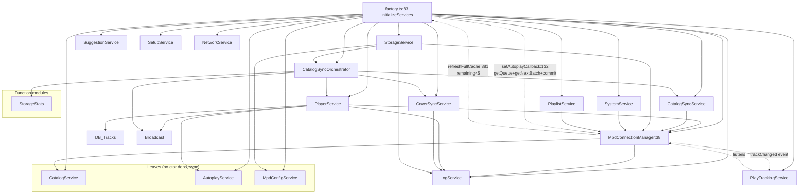

# Backend Services — Dependency Graph

> Generated 2026-09-12. Source: `packages/backend/src/services/**` + `factory.ts` + `controllers/**` + `ws/**`.
> Conventions: arrow `A --> B` means A depends on / calls B. `sync` = `node:sqlite` `DatabaseSync` blocking (no `await`).

## Mermaid Graph

## Service Inventory

| Service                   | Type                 | Ctor deps                                                 | DB repos                                                       | External                                       | Factory getter                                                           | Notes                                                           |
| ------------------------- | -------------------- | --------------------------------------------------------- | -------------------------------------------------------------- | ---------------------------------------------- | ------------------------------------------------------------------------ | --------------------------------------------------------------- |
| `CatalogService:1`        | iface+class          | —                                                         | `artistsDb`, `albumsDb`, `genresDb`, `tracksDb`                | —                                              | `getCatalogService:154` + aliases `getTrack/Artist/Album/Genre:159` sync | 21 sync methods (unified)                                       |
| `AutoplayService:10`      | class                | —                                                         | `tracksDb`, `albumsDb.getRankedByPlayCount`                    | —                                              | `getAutoplayService:184`                                                 | `getNextBatch:42` sync, `AUTOPLAY_BATCH_TARGET=25`              |
| `MpdConfigService:1`      | iface+class          | —                                                         | —                                                              | `fs`, `execSync+checkTool`                     | `getMpdConfigService:209` + aliases `getConfig:214`/`getAudio:229`       | unified `MPD_CONFIG_PATH`, `restartMpdInternal`                 |
| `MpdConnectionManager:38` | class (EventEmitter) | `CatalogService` (`TrackService`), `LogService`           | via `CatalogService.resolveTrack:332`                          | `net`, `mpd@1.3.0`                             | `getMpdConnectionManager:179`                                            | dual TCP, cache, poll 2s/10s, autoplay refill `381`             |
| `PlayerService:35`        | iface+class          | `LogService`, `Mpd`, `AutoplayService`                    | `tracksDb`, `albumsDb`                                         | `broadcast`, `mpdLogReader`, `path`            | `getPlayerService:189`                                                   | 14 `refreshNow()` paths, `updateLibrary:283` belongs to library |
| `CatalogSyncService:22`   | class                | `MpdConnectionManager`                                    | `catalogSyncDb.rebuild:87`, `tracksDb`, `syncMetadataDb`       | —                                              | `getCatalogSyncService:194`                                              | `fetchAllTracks:29` list+find                                   |
| `CatalogSyncOrchestrator:21`       | iface+class          | `PlayerService`, `CoverSyncService`, `CatalogSyncService`     | `statsDb`, `artistsDb`, `albumsDb`, `tracksDb`                 | `broadcast`, `scanStorageStats`                | `getCatalogSyncOrchestrator:204`                                                  | orchestrator 3 phases                                           |
| `CoverSyncService:38`         | iface+class          | `LogService`                                              | `albumsDb`, `tracksDb`, `artistsDb`                            | `fs`, `sharp:4`, `music-metadata:5`, `crypto`  | `getCoverSyncService:199`                                                    | sequential `for album:49`                                       |
| `PlaylistService:28`      | iface+class          | `MpdConnectionManager`                                    | `playlistsDb`, `tracksDb`, `artistsDb`, `albumsDb`, `genresDb` | —                                              | `getPlaylistService:240`                                                 | MPD mirror `.catch(()=>{})` silent                              |
| `StorageService:64`       | iface+class          | `Mpd`, `CatalogSyncOrchestrator`, `MpdConfigService`, `LogService` | `storageDb`                                                    | `fs symlink`, `child_process mount`, `crypto`  | `getStorageService:219`                                                  | 556 LOC, 4 deps                                                 |
| `SystemService:22`        | iface+class          | `MpdConnectionManager`                                    | —                                                              | `os`, `execSync aplay/lsusb`, `readAppVersion` | `getSystemService:224`                                                   | delegates `checkTool` to `utils`                                |
| `PlayTrackingService:11`  | class                | `EventEmitter` (=Mpd)                                     | `tracksDb.incrementPlayCount:33`                               | `events`                                       | `getPlayTrackingService:234`                                             | 38 LOC, debounce 5s                                             |
| `LogService:16`           | iface+class          | —                                                         | —                                                              | `console`, `broadcast`                         | `getLogService:149`                                                      | ring 500                                                        |
| `SuggestionService:4`     | iface+class          | —                                                         | `albumsDb`, `tracksDb`                                         | `Math.random`                                  | `getSuggestionService:244`                                               | `getDashboard` sync                                             |
| `SetupService:1`          | iface+class          | —                                                         | `setupDb`, `storageDb`                                         | —                                              | `getSetupService:249`                                                    | 7 methods via class wrapper                                     |
| `NetworkService:7`        | iface+class          | —                                                         | —                                                              | `os.networkInterfaces`, `dns.lookup`           | `getNetworkService:254`                                                  | `3000ms` timeout                                                |
| `StorageStats:69`         | fns                  | —                                                         | `storageDb`                                                    | `fs readdirSync/statSync`                      | —                                                                        | `walkSource:24` blocking                                        |

## Fan-in / Fan-out

- **Highest fan-in:** `MpdConnectionManager` ← 6 (`PlayerService`, `CatalogSyncService`, `StorageService`, `SystemService`, `PlaylistService`, `PlayTrackingService`) + factory callback.
- **Highest fan-out:** `StorageService` (4), `CatalogSyncOrchestrator` (3).
- **Cycle:** `MpdConnectionManager:381 --remaining<5--> factory:103 setAutoplayCallback --> PlayerService.getQueue + AutoplayService.getNextBatch --> MpdConnectionManager`.

## Leaky Boundaries

Fixed — `dashboardController.ts` now `getSuggestionService()`, `systemController.ts` via `getSetupService()`/`getNetworkService()`. DB boundary clean (`routes/`, `controllers/*`, `ws/`, `app.ts` have 0 `@repo/db` imports outside `server.ts` lifecycle).

## Splittable vs Mergiable — Status

| Action                                                                                 | Status   | Rationale                                                                          |
| -------------------------------------------------------------------------------------- | -------- | ---------------------------------------------------------------------------------- |
| **Mergiable: Catalog** — `Artist+Album+Genre+Track → CatalogService` (~180 LOC)        | **Done** | Unified sync interface, single impl `catalogService.ts:1`                          |
| **Mergiable: MPD config** — `AudioService+ConfigService → MpdConfigService` (~430 LOC) | **Done** | Unified `MPD_CONFIG_PATH`, single `restartMPD`                                     |
| **Register leaky 3 in factory**                                                        | **Done** | `getSuggestionService:244`, `getSetupService:249`, `getNetworkService:254`         |
| **Splittable: StorageService 556 LOC**                                                 | Kept     | Preserved per request — no split                                                   |
| **Splittable: MpdConnectionManager 510 LOC**                                           | Kept     | Preserved per request — no split                                                   |
| **Move: PlayerService.updateLibrary:283**                                              | Open     | Reads `mpdLogReader:10`, belongs to `CatalogSyncOrchestrator`/`CatalogSyncService` — future |

## How to Regenerate

Re-run the explore prompts in `AGENTS.md` analysis or `rg -n "from \"@repo/db\"|from \"@services" packages/backend/src/services --no-heading`.
